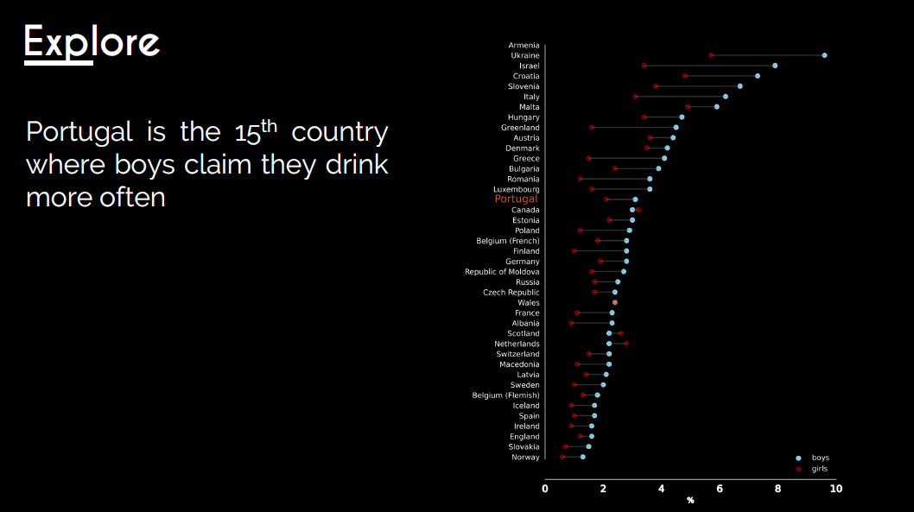

# Genetic-Programming-Predictive
Prediction of Children's alcohol behaviors using Python and Genetic Programming algorithms

## 1. Abstract
The aim of this project is to build a regressive
model that is able to predict, at a macro level,
the percentage of children with dangerous
alcohol behaviors in a country. In order to
achieve this, we applied several techniques
of data preprocessing, feature engineering,
Machine Learning models and, additionally,
the introduction of Genetic Programing within
the scope of the project. The focus was on
benchmarking different models with different
parameters and compare and access the
results. The best model should be a model
that will have a good generalization ability
and small variation of its predictions, allowing
us to make rather good conclusions and
predictions. Regarding the target variable,
we want to predict the alcohol frequency,
represented by the proxy feature alcopops.

 

## 02. Explore
Having collected the data from three different sources and three different years, we had to do a lot of preprocessing to get all the data on the same
granularity. Our first approach in the exploration phase
was to overview the variables and their distribution, briefly
discussed on the Project 2 Description. After a brief
exploration, we could observe which countries presented
higher frequencies of alcohol consumption. In Figure 2.
we present the gender gap in the last collected year
(2014). It is also noticeable that boys in Portugal claim
they have the 15th highest alcohol frequency consumption
between all collected countries.

 

### 02.1 Missing Values
Before splitting the data, we need to understand
the quality of the data, namely, the missing
values in the dataset. As we can see from the
Figure 3., we have some 6 features whose
missing value percentage is higher than the
established 3 % threshold. One of them is our
target variables. For the observations with
missing values in the target variable we decided
to drop them, since they will bring no predictive
power to our models. For the remaining
features, below and above the threshold, since
we have a small dataset, we decided not to drop
any observation and fill the missing values.

 

### 02.2 Correlations
The next step in the exploration phase is to
see how features are correlated amongst
themselves. At first sight, in chart 3,we can
see that the most noticeable correlation
with the alcohol frequency is the year when
the data was collected and with the children
having his/her first drunk experiences at the
ages of 13 years old or younger, with
correlation values of -0.43 and 0.51,
accordingly. For the remaining independent
features, we can also observe a strong
correlation between the country GDP per
capita and the teenage pregnancy (-0.56),
exercise and teenage pregnancy (-0.52) and,
the highest dependency, the age of the first
drunk experience and if the child has been drunk or not (0.91).

 
  
## 03. Modify
For the following chapters and project framework, we had to split the data between Training and Testing.
As we have a small dataset, the percentage defined for testing was set at 10%. Furthermore, we decided
to perform this action with 5 different seeds, so in the end, we can get the generalization ability of the
models in 5 different testing sets and make better conclusions. Since the scope and objective of this
project is not to explore all the possibilities in terms of preprocessing of data, we did not experiment a
lot of different methods.
For all decisions, we performed all possibilities and benchmarked them, however, in each chapter, we will
present the boxplot of the results only depending on that specific decision, over five runs, i.e.: For
Imputing Missing values, all other decisions are turned off except for this option.

### 03.1 Imputing Missing Values
For imputation of Missing Values, we
compared the generalization ability of dealing
with missing values or just dropping them. It
is important to notice that if we drop all
observations with missing values in the
training set, we would get around half of the
dataset size (from around to 200 to 100
observations).

 

### 03.2 Deal with Outliers
Given that we are handling with data at a
macro level, we do not expect to encounter a
high number of outliers, since all individual
observations will be smoothed by the
majority. Having a small of data, we don’t
want to remove observations classified as
outliers, instead, we want to smooth them,
hoping that this will improve the predictive
ability of the models. As outlier options, we
decided to ignore them or to deal with them,
by applying a smoothing technique that will,
for all features, establish the 5th and 95th
percentile and, for values smaller of higher
than these thresholds, smooth the data according to the closest of the selected percentiles. A Priori, we
expect that dealing with outliers, in this case, will not have a huge impact in the results.

 
  
## 04. Feature Selection
Having 21 independent features, another
important point to make is whether we will
ignore the Curse of Dimensionality or reduce
the number of variables, since it can improve
the computational effort of the algorithms and,
by removing redundant features, avoid
multicollinearity issues. However, since the
process is a trade-off, we can expect to lose
some information. For this method, we
performed a Recursive Feature Analysis with a
Linear Regressor estimator.

 
 
## 05. Decomposition: PCA
Instead of performing feature selection or, on
top of this step, we can also decompose the
data into principal components, which are not
correlated amongst themselves. For deciding
the ideal number of components, since we
cannot find a way of looking at the elbow
graph automatically in all the runs, we are
setting the threshold on the component
whose cumulative variance withholds 80% of
the explained total variance.

 
  
## 06. Baseline Models Benchmark
For the baseline models we experimented the following models:
§ Random Forest Regressor
§ Gradient Boosting Regressor
§ Ada Boost Regressor
§ Bagging Regressor
We experiment all preprocess option combination, over 5 different runs and seeds, resulting in 56
different outputs. In each run, a grid search with 5 cross validations was performed in order to find the
best hyperparameters and use the best estimator of each model. In table 1, the best and worst five
models, according to the Negative Mean Absolute Error, are shown.

 

From Table 1., we can see that, amongst the baseline models (tuned in grid search), Gradient Boost
appears to have better results, as well as a rather small variation in its average results. To make a further
conclusion about the best decisions to make in preprocessing, we decided to evaluate the generalization
ability of the four models grouped by the decisions themselves. For this purpose, we created an id that
represents each model according to the choices that were made:
Figure 8. PCA Transformation Benchmark
A Priori assumptions
We expect the best generalization ability from the models with missing imputation and outlier smoothing, as
well as variable selection.
5
1. Impute Missings: True or False
2. Smooth Outliers: True or False
3. Variable Selection: True or False
4. PCA: True or False
{(𝑇, 𝐹); (𝑇, 𝐹); (𝑇, 𝐹); (𝑇, 𝐹)}

So, for example, TTFF stands for imputing
Missings, dealing with outliers but not
performing variable selection and
decomposition.
From Figure 9., we can see that some
decisions achieve a higher generalization
ability than others. Overall, imputing
Missings appears to be a good call. On the
other hand, decomposition and variable
selection appear to lower the generalization
ability of the models, unlike our a priori assumptions the most difficult decision to make was whether
outliers should be smoothed or not. Since the difference between this choice is not so relevant, we
decided to play it safe and perform outlier smoothing, making our decision representation as {𝑇, 𝑇, 𝐹, 𝐹}.

### 06.1 Artificial Data
Having a small amount of data, we
wondered if producing artificial data would
improve the generalization ability of our
models. Having in consideration that we are
dealing with a regression problem, the usual
packages to generate data such as SMOTE
did not work, since they are oriented
towards a classification problem. Following
the same logic, we decided to try our own
technique to generate data. We start by
generating clusters using the K-Means
algorithm and, using the centroids, we
calculate the distance between the cluster
center and each point in that group and then
generate a random point between these two
coordinates. We tried different number of clusters
and proportion of data to generate, presented in
Table 2. Based on the results, it appears that it is
not worth it, in terms of computational effort,
generate artificial data, since the payoff from the
generalization ability does not change a lot.
The conclusions obtained in this benchmark were
applied to the preprocessing of the data imputted
in the genetic programming framework.

 

 

## 07. Genetic Programming

 

## 08. Genetic Programming Initial Benchmark
For genetic programming we had some big decisions to make, namely, what selectors, crossover and
mutations to use. For choosing the best combination, we decided to follow the funnel framework and
start by the best selector to use in our final GP model.

## Initialization
For a first approach, we tried the different
initialization methods available in the baseline,
namely grow, full, half and half and EDDA. From
the results show in Figure 11., all initializations
have the same average performance, except for
EDDA, that looks promising. However, this
method presented a real bad result on its first
run (seed 0). We decided to proceed with this
method and try to prevent this with other
operators or fine tuning of the parameters.
Furthermore, we also tried the next
benchmarking phase with Half and Half to compare it do EDDA.

 

## Selectors
Having implemented 5 new selection
methods, we experimented them with the
same parameters used on the previous
benchmark. By looking at Figure 12, we can
see that EDDA has a better performance in
almost all selectors and that the one outlier
situation continues. Despite having similar
results to tournament selection, rank
selection appears to have a better
generalization ability and less variability so,
we continued using this method.

 
  
## Crossover
Having established the initialization method
and selector, the following two choices to be
made in this initial benchmarking phase was
what crossover and mutation method to use.
In terms of crossovers, Uniform, Simple and
the baseline crossover were tested, where,
presenting similar results, we decided to go
with the one provided in the baseline. The 2
Tree Crossover, although it is implemented, it
crashed at later runs, so we decided to not
benchmark it.

 
  
## Mutation
For mutation operators, we experimented the
baseline ones (Subtre, point and hoist), versus
the ones that we implemented (shake, graft,
swap and reverse). For this purpose, we
lowered the crossover probability to 0.1 and
increases the mutation probability to 0.9.
Despite this not making a lot of sense, given
the randomness of mutation, our objective
was to see what operator presented better
initial results.

 
  
## 09. Genetic Programming Fine Tuning
Having the initial and overview benchmark done on genetic programming, we proceeded to the fine tune
the algorithm, this is, adjust the hyperparameters such as population size, number of generations, best
crossover and mutation probability, stopping criteria and edda parameters.

### 09.1 Population Size
Starting off with the population size, we tried
increasing our baseline pool size of 200 to 250,
500, 750 and 1000. The results shown in figure
14 revealed that, in these ranges, for our
problem, the generalization ability does not
suffer a lot of changes but appears to have
better results between a pool size of 250 and
1000, thus, we decided to proceed with a
population of 500 individuals.

### 09.2 Number of Generations
For the number of generations to run, we tried
the same intervals experimented on
population size, this is: [250, 500, 750, 1000].
Since the results are very similar, we decided
to reduce the computational effort and choose
250 generations to run from this point on.

### 09.3 Crossover and mutations
In terms of crossover and mutation fine
tuning, having established the correct
crossover and mutation, we want to know to
which extent should the probabilities of
crossover and mutation affect the
generalization ability. Thus, we defined a
function that tries crossover with probabilities
25%, 50%, 75% and 100%. For mutation, since
the sum of these operators must be equal to

### 09.4 Edda Params
In terms of EDDA initialization parameters, we experimented to benchmark the percentage of population
calculated with semantical operators, with partitions of 10%, 20%, 30% and 40%, the probability of
mutation with 25%, 50%, 75% and 100%. The effect of different levels of maturation was also tested,
namely, from 1 to 10 and compared to the baseline provided (5). Lastly, we tried running the genetic
programming algorithm
with deme sizes of 25, 50,
75 and 100. The results
were pretty consistent,
but we delimitated the
following strategy:
Running the following
epochs with 10% of
population being
calculated with semantical
operators, an EDDA
mutation probability of
100%, maturation of 9 and
a demme size of 50, as
settled in the baseline.

### 10. GP Semantic operators
Before comparing genetic
programming to our baseline
ensembles, we also tried to run it with
semantic operators, with and without
semantical computation enabled, that
modifies the structure of the trees.
This was a challenging task since we
faced some problems in this part,
namely the exponential growth of the
trees that really difficulted the
benchmarking. Due to computational
effort, we decided to run this segment
with only 10 generations and Half and Half initialization. By looking at the results, we can get a clear
glance on how semantical computation parameter set to False improves the generalization ability on the
crossover provided in the baseline.

## 11. Comparing GP to Ensemble regressors
After having all the Genetic Programming parameters tuned, we wanted to compare the performance
against the baseline ensembles. To have better and more consistent results, we also ran the algorithms
more times, totalizing 20 different seeds (runs).

**A Priori assumptions
We expect a better performance, in terms of generalization ability and results variation, from a more complex
evolutionary algorithm like Genetic Programming, when compared to the baseline ensembles.**

 

Contrary to our initial beliefs, what was observed afterwards was that, for this problem, Genetic
Programming appears to have a lower generalization ability than all baseline ensembles. In the end, as
shown in the ensembles benchmark, Gradient Boosting regressor reveals to have the best results.
Performing a T-Test for mean independence, between the results of Gradient Boosting and GP, we can
conclude that, with a t-score of 4.79 and a p-value of 0.003%, the mean results from these two algorithms,
considering the usual confidence thresholds of 1%, 5% and 10%, are indeed different.

## 12. Conclusions
Overall, this was a very interesting project to tackle, since we got to gather our own data. However, this
data collection process was very challenging. We had to read some articles to know what were the most
important factors that were influencing children’s risky behaviors. Furthermore, besides collecting data
from 3 different sources, we had to modify all data from the World Health Organization, transforming
each table into just one variable.
After collecting the data, the exploration and preprocessing of data was made. Since the objective of this
project was not to explore all methods of pre-processing of data, we decided to follow a simpler train of
thought and try a single method for each stage. Contrary to our initial beliefs, variable selection and
decomposition did not improve the generalization ability of the models. However, imputing missing
values and smoothing outliers appear to, to some extent, help the models achieve a better performance.
Then, benchmarking of genetic programming was made, with some new operators and selector
techniques implemented. This phase was the most time consuming, since these algorithms are more
complex and require more attention. After fine tuning GP, we faced some problems when dealing with
semantic GP, that stopped us from better benchmarking these operators.
Lastly, when comparing all algorithms, we reached the conclusion that, for predicting children’s alcohol
consumption in countries, Gradient Boosting regressor appears to be the best choice.

 

 

## 13. Bibliography
[1] R. Poli and W. Langdon, "On the Search Properties of Different Crossover Operators in Genetic
Programming," Proceedings of Genetic Programming’98.

[2] J. Eggermont, "Genetic Programming," Parallel Problem Solving from Nature - PPSN IX, 13 9 2006.

[3] G. F. Guide. [Online]. Available: https://dces.essex.ac.uk/staff/rpoli/gp-fieldguide/
22InitialisingthePopulation.html. [Accessed 5 2019].

[4] P. D'haeseleer, "Context Preserving Crossover in Genetic Programming".

[5] A. Swalin, "How to Make Your Machine Learning Models Robust to Outliers," 31 5 2018. [Online].
Available: https://heartbeat.fritz.ai/how-to-make-your-machine-learning-models-robust-to-outliers-
44d404067d07. [Accessed 5 2019].

